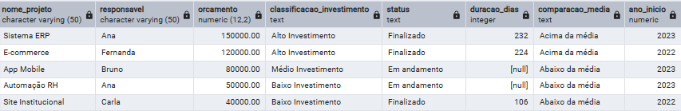

# 📊 Projeto SQL — Análise de Projetos

## 🎯 Objetivo
Realizar uma análise de projetos para entender:
- Distribuição de investimentos
- Status dos projetos (em andamento ou finalizados)
- Tempo de duração
- Comparação com orçamento médio

---

## 🧱 Base de dados
Tabela: `revisao.projetos_estudo`

Principais colunas:
- nome_projeto
- responsavel
- data_inicio
- data_fim
- orcamento
- status

---

## 📊 Análises realizadas

### 🔹 1. Exploração inicial
Consulta geral dos dados, ordenações e filtros básicos.

Arquivo: `01_exploracao_dados.sql`

---

### 🔹 2. Métricas gerais
Cálculo de indicadores como:
- Total investido
- Média de orçamento
- Projetos por responsável

Arquivo: `02_metricas_gerais.sql`

---

### 🔹 3. Análise consolidada
Criação de uma visão completa dos projetos incluindo:
- Classificação de investimento (baixo, médio, alto)
- Status do projeto
- Duração em dias
- Comparação com orçamento médio
- Filtro por período

Arquivo: `03_analise_consolidada.sql`

---

## 🚀 Insights possíveis

- Identificar projetos com maior investimento
- Avaliar eficiência (tempo de duração)
- Entender distribuição de orçamento
- Comparar projetos com média geral

---

## 📊 Resultado da Análise

A consulta apresenta uma visão consolidada dos projetos, incluindo classificação de investimento, status e duração, permitindo análise de desempenho e apoio à tomada de decisão.

