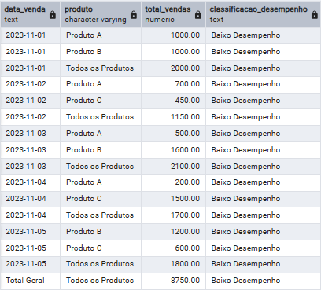

# 📊 Projeto SQL — Análise de Vendas com Agregações Avançadas

## 🎯 Objetivo
Realizar uma análise de vendas utilizando agregações avançadas, permitindo visualizar totais, subtotais e padrões de desempenho ao longo do tempo.

---

## 🧱 Base de dados
Tabela: cap10.vendas

Principais colunas:
- Produto
- Vendedor
- Quantidade
- ValorUnitario
- DataVenda

---

## 📊 Análises realizadas

### 🔹 1. Exploração inicial
Visualização e entendimento da base de vendas.

### 🔹 2. Métricas gerais
Cálculo de vendas por produto, vendedor e data.

### 🔹 3. Análise de agregações avançadas
Uso de funções como:
- ROLLUP
- GROUPING SETS

---

## 🧠 Técnicas utilizadas
- GROUP BY
- ROLLUP
- CASE WHEN
- COALESCE
- SUM

---

## 🚀 Insights possíveis
- Evolução das vendas ao longo do tempo
- Subtotais por produto
- Total geral consolidado
- Identificação de padrões de desempenho

---

## 📊 Resultado da Análise

A consulta apresenta uma visão hierárquica das vendas, incluindo subtotais por data e produto, além do total geral, utilizando a função ROLLUP para facilitar a análise de desempenho.

