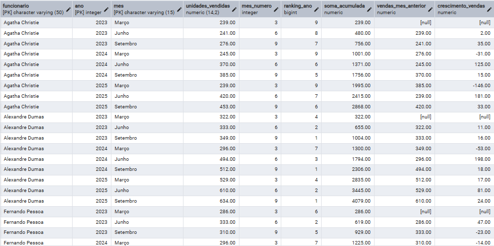

# 📊 Projeto SQL — Análise de Performance com Window Functions

## 🎯 Objetivo
Analisar a performance de vendas ao longo do tempo utilizando funções analíticas, permitindo identificar padrões, tendências e desempenho dos funcionários.

---

## 🧱 Base de dados
Tabela: cap12.vendas

Principais colunas:
- funcionario
- ano
- mes
- unidades_vendidas

---

## 📊 Análises realizadas

### 🔹 1. Exploração inicial
Visualização e entendimento dos dados.

### 🔹 2. Métricas gerais
Análise de vendas por período e funcionário.

### 🔹 3. Análise temporal avançada
Uso de Window Functions para análise de desempenho ao longo do tempo, incluindo:

- Ranking de vendas por ano
- Soma acumulada por funcionário
- Comparação com período anterior
- Cálculo de crescimento de vendas entre períodos

---

## 🧠 Técnicas utilizadas
- Window Functions
- RANK()
- LAG()
- SUM() OVER
- PARTITION BY
- CASE WHEN

---

## 🚀 Insights possíveis
- Funcionários com melhor desempenho por ano
- Evolução individual das vendas ao longo do tempo
- Identificação de crescimento ou queda nas vendas
- Análise de tendência com base em valores acumulados
- Comparação entre períodos consecutivos- Funcionários com melhor desempenho
- Evolução de vendas ao longo do tempo
- Tendências de crescimento ou queda
- Comparação entre períodos

---

## 📊 Resultado da Análise

A consulta apresenta a evolução das vendas por funcionário ao longo do tempo, incluindo ranking anual, soma acumulada e comparação com períodos anteriores, permitindo identificar tendências de crescimento e desempenho.

